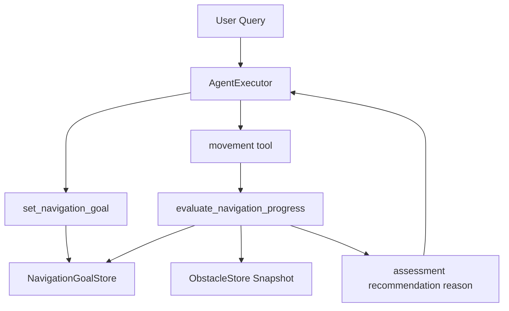

# 터틀별 진행도 평가 구현 계획

## 구현 범위
- 이슈 #69를 기준으로 `turtle_agent`에 터틀별 navigation goal 상태와 진행도 평가 도구를 추가합니다.
- 1차 구현은 평가 계산과 구조화된 반환에 집중합니다. 이동 명령 자동 보정, 후보 행동 선택, 경로 계획 변경은 제외합니다.
- 기존 `ObstacleStore`, `get_turtle_pose`, `check_path_against_obstacles`의 패턴을 재사용해 변경 범위를 줄입니다.

## 대상 파일
- 신규 순수 계산 모듈: [`src/turtle_agent/scripts/navigation_progress.py`](src/turtle_agent/scripts/navigation_progress.py)
  - ROS/LangChain 의존 없이 goal 상태, 거리 계산, 장애물 거리, 평가 등급을 처리합니다.
- 신규 도구 모듈: [`src/turtle_agent/scripts/tools/navigation.py`](src/turtle_agent/scripts/tools/navigation.py)
  - `@tool` 기반 `set_navigation_goal`, `evaluate_navigation_progress`, 필요 시 `clear_navigation_goal`을 제공합니다.
- 도구 등록: [`src/turtle_agent/scripts/turtle_agent.py`](src/turtle_agent/scripts/turtle_agent.py)
  - `navigation_tools.configure_navigation_context(...)` 호출 및 `tool_packages`에 신규 도구 모듈을 추가합니다.
- 테스트: [`tests/test_turtle_agent/test_navigation_progress.py`](tests/test_turtle_agent/test_navigation_progress.py), [`tests/test_turtle_agent/test_navigation_tools.py`](tests/test_turtle_agent/test_navigation_tools.py)
  - 순수 계산 로직과 LangChain tool wrapper 동작을 분리 검증합니다.

## 설계 흐름

## 구현 단계
1. 브랜치 준비
   - 사용자 승인 후 `dev` 최신 반영 및 `feat/turtle-agent/navigation-progress-evaluator` 브랜치를 생성합니다.
   - PR 본문에서는 `Refs #69`로 연결합니다.

2. 순수 계산 코어 작성
   - `NavigationGoal` dataclass를 정의합니다.
   - 필드는 `turtle`, `start`, `final_goal`, `initial_goal_distance`, `previous_goal_distance`, `active_obstacles`, `previous_obstacle_distances`를 포함합니다.
   - `goal_distance_delta < 0`이면 `good_progress`, 장애물 회피 중 목표 거리가 증가했지만 장애물 거리가 증가하면 `good_avoidance`, 둘 다 악화되면 `bad_regression`처럼 명확한 평가값을 반환합니다.
   - AABB, circle, segments 장애물에 대해 “터틀 중심점에서 장애물 표면까지의 signed/unsigned gap”을 계산하는 helper를 둡니다.

3. 도구 wrapper 작성
   - `set_navigation_goal(name, goal_x, goal_y, turtle_radius=0.5, safety_margin=0.2, obstacle_kinds="temporary")`를 추가합니다.
   - 현재 위치는 `tools.turtle.get_turtle_pose.invoke(...)`로 조회합니다.
   - 장애물 후보는 공유 `ObstacleStore.snapshot()`으로 가져오고, 기존 `tools.obstacle`의 경로 충돌 판단 방식과 동일한 기준을 사용합니다.
   - `evaluate_navigation_progress(name)`는 현재 위치를 조회한 뒤 저장된 goal과 비교하고 JSON 문자열로 결과를 반환합니다.
   - goal이 없을 때는 실행 실패가 아니라 명확한 오류 JSON을 반환해 AgentExecutor가 다음 조치를 판단할 수 있게 합니다.

4. Agent 연결
   - `TurtleAgent.__init__`에서 기존 장애물 store를 navigation 도구에도 주입합니다.
   - `tool_packages=[turtle_tools, obstacle_tools, navigation_tools]`처럼 신규 도구 패키지를 등록합니다.
   - 기존 reset 흐름에서 goal 상태가 오래 남지 않도록 `reset_turtlesim` 이후 또는 신규 `clear_navigation_goal` 호출로 정리 가능한 구조를 제공합니다.

5. 프롬프트 반영
   - [`src/turtle_agent/scripts/prompts.py`](src/turtle_agent/scripts/prompts.py)에 최소 규칙을 추가합니다.
   - 이동 목표가 명확한 작업은 먼저 `set_navigation_goal`을 호출하고, 이동 후 `evaluate_navigation_progress`를 호출하도록 안내합니다.
   - 평가 결과의 `assessment`, `recommendation`, `reason`을 다음 이동 도구 호출에 참고하도록 명시합니다.

6. 테스트 및 검증
   - 순수 계산 테스트: 목표 거리 감소, 목표 거리 증가, 장애물 회피로 인한 긍정 평가, 장애물 거리 악화에 따른 부정 평가를 검증합니다.
   - 도구 테스트: mock 또는 monkeypatch로 현재 pose를 고정하고, `ObstacleStore`에 임시 장애물을 넣어 `set_navigation_goal`과 `evaluate_navigation_progress` 반환 JSON을 검증합니다.
   - 로컬 검증은 `uv run pytest tests/test_turtle_agent/test_navigation_progress.py tests/test_turtle_agent/test_navigation_tools.py`와 `uv run ruff check src/ tests/`, `uv run ruff format src/ tests/`를 사용합니다.

## 리스크 및 대응
- LLM이 평가 도구 호출을 생략할 수 있습니다. 1차 대응은 프롬프트 규칙이며, 이후 필요하면 이동 도구 내부 guard로 확장합니다.
- 장애물 회피 중 목표 거리가 증가하는 정상 상황이 있습니다. 목표 거리만 보지 않고 활성 장애물과의 거리 변화도 함께 평가합니다.
- segments/AABB 거리 계산은 구현 실수가 생기기 쉽습니다. 기존 `collision_geometry.py`의 segment closest-point 계산 패턴을 재사용하고 단위 테스트를 추가합니다.

## 완료 기준
- 터틀별 최종 도착지가 명시적으로 저장됩니다.
- 이동이 여러 번 나뉘어도 저장된 최종 도착지 기준으로 진행도가 평가됩니다.
- 장애물 위험 여부에 따라 목표 거리와 장애물 거리 평가가 분기됩니다.
- 평가 결과는 `assessment`, `recommendation`, `reason`을 포함한 JSON으로 반환됩니다.
- 신규 테스트와 ruff 검증을 통과합니다.