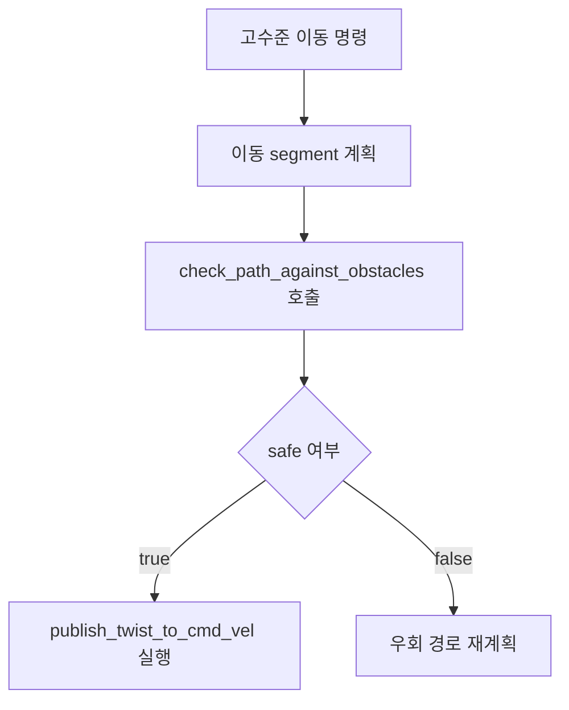

# 경로 충돌 검사 도구 구현 계획

## 목표

- TurtleAgent가 이동 전 경로 안전성을 확인할 수 있도록 장애물 경로 충돌 검사 도구를 추가한다.
- 기본 검사 대상은 `temporary` 장애물로 제한해, 사용자가 “장애물을 피하라”고 요청했을 때 임시 장애물을 통과하지 않도록 한다.
- 이 계획은 이미 구현된 변경을 다른 개발자가 검토·재현할 수 있도록 작성한 참조용 계획이다.

## 포함 범위

- [`/Users/jongphago/Documents/Projects/rosa/src/turtle_agent/scripts/tools/obstacle.py`](/Users/jongphago/Documents/Projects/rosa/src/turtle_agent/scripts/tools/obstacle.py)
  - `collision_geometry.py`의 기존 충돌 판정 함수 재사용
  - 경로 segment와 장애물 geometry 간 충돌 여부를 판단하는 내부 helper 추가
  - LangChain tool인 `check_path_against_obstacles` 추가

- [`/Users/jongphago/Documents/Projects/rosa/tests/test_turtle_agent/test_obstacle_tools.py`](/Users/jongphago/Documents/Projects/rosa/tests/test_turtle_agent/test_obstacle_tools.py)
  - 임시 AABB 장애물 통과 차단 테스트
  - 임시 AABB 장애물 우회 허용 테스트
  - 기본값에서는 static 장애물을 검사하지 않고, 명시 시 검사하는 동작 테스트

## 제외 범위

- `prompts.py` 프롬프트 변경
- `memory_prompting.py` 메모리 정책 변경
- 로그 파일 변경
- 실행 환경 설정 변경
- 기존 이동 도구의 동작 변경

## 구현 단계

1. `obstacle.py`에 충돌 판정 함수 import를 추가한다.

```python
from collision_geometry import (
    any_segment_intersects_disc,
    circle_intersects_aabb,
    segment_intersects_disc,
)
```

2. 경로와 AABB 교차를 판단하는 내부 helper를 추가한다.

- 목적: `wet` 같은 사각형 장애물의 확장 영역을 이동 선분이 통과하는지 판단한다.
- 함수: `_segment_intersects_aabb`

3. segment 장애물 대응 helper를 추가한다.

- 목적: 벽이나 선분 장애물과 터틀 이동 경로가 직접 교차하거나, 터틀 반경 및 안전 여유 거리 안에 들어오는지 판단한다.
- 함수: `_point_on_segment`, `_orientation`, `_segments_intersect`, `_segments_within_distance`

4. 단일 장애물 판정 helper를 추가한다.

- 목적: 장애물 geometry 종류에 따라 적절한 충돌 판정 함수를 선택한다.
- 함수: `_path_hits_obstacle`
- 처리 기준:
  - circle: 장애물 반경에 clearance를 더해 선분-원 교차 검사
  - aabb: AABB를 clearance만큼 확장한 뒤 선분-AABB 교차 검사
  - segments: 경로와 장애물 선분의 교차 또는 clearance 이내 접근 검사

5. LangChain tool을 추가한다.

- 함수: `check_path_against_obstacles`
- 입력:
  - 시작 좌표
  - 종료 좌표
  - 터틀 반경
  - 안전 여유 거리
  - 검사할 장애물 종류 목록
- 기본값:
  - `turtle_radius=0.5`
  - `safety_margin=0.2`
  - `obstacle_kinds="temporary"`
- 반환:
  - JSON 문자열
  - `safe`: 이동 가능 여부
  - `blocked_by`: 충돌 가능성이 있는 장애물 목록
  - `recommendation`: 진행 또는 재계획 권고

6. 단위 테스트를 추가한다.

- temporary AABB를 관통하는 경로는 `safe=false`가 되어야 한다.
- temporary AABB를 충분히 우회하는 경로는 `safe=true`가 되어야 한다.
- static 장애물은 기본 검사 대상에서 제외되어야 하며, 검사 대상에 명시하면 차단되어야 한다.

## 기대 동작



## 검증 계획

- 정적 확인:
  - `ReadLints`로 `obstacle.py`, `test_obstacle_tools.py` 진단 오류 확인
  - `python3 -m py_compile src/turtle_agent/scripts/tools/obstacle.py tests/test_turtle_agent/test_obstacle_tools.py`

- 단위 테스트:
  - `uv run python -m unittest tests.test_turtle_agent.test_obstacle_tools`

## 확인된 제약

- 시스템 Python에서는 `langchain` 미설치로 unittest import가 실패할 수 있다.
- `uv run` 기반 테스트는 환경 상태에 따라 의존성 준비 단계에서 오래 걸릴 수 있다.
- 이번 변경은 도구 추가에 한정되며, LLM이 이 도구를 반드시 호출하도록 만드는 프롬프트 강화는 별도 이슈/PR에서 다룬다.
