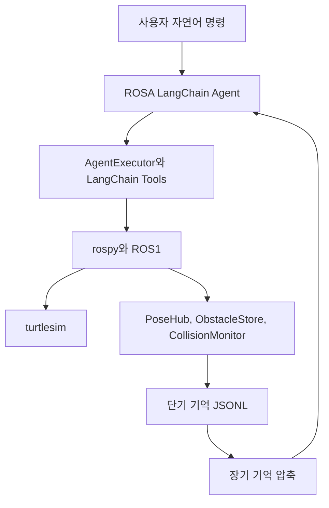

# ROSA Turtle Agent

ROSA Turtle Agent는 NASA JPL의 [ROSA](https://github.com/nasa-jpl/rosa)를 포크하여, ROS1 `turtlesim` 환경에서 자연어 명령·도구 실행·장단기 기억을 연결한 에이전틱 로보틱스 실험 프로젝트입니다. 본 프로젝트는 여러 로봇이 수행한 행동과 충돌 경험을 메모리로 축적하고, 이후 세션에서 그 기억을 활용해 행동이 개선되는지 관찰합니다.

원본 ROSA 프로젝트의 전체 소개와 upstream README는 [`README.upstream.md`](README.upstream.md)에 보관했습니다.

## 프로젝트 개요

본 프로젝트의 문제 설정은 기억을 잃은 여러 로봇에게 업무 기억을 설계·주입하여 자동화 공장을 다시 가동시키는 것입니다. 여기서 데이터는 로봇의 행동을 실행하고 개선하는 단기 기억과 장기 기억으로 정의합니다.

실험 목표는 다음 두 가지입니다.

- 장단기 메모리 데이터 스키마를 설계한다.
- 메모리 기반 행동 개선을 `ROSA(LangChain) - ROS1 - turtlesim` 환경에서 관찰한다.

실험은 `turtlesim`의 여러 거북이를 로봇 역할로 사용합니다. 첫 번째 세션에서는 장애물 충돌 같은 실행 경험을 기록하고, 두 번째 세션에서는 이전 세션에서 생성한 장기 기억을 주입해 같은 유형의 임무를 더 안전하게 수행하는지 확인합니다.

## 주요 기능

### 에이전틱 로보틱스 5계층 구현

이 저장소는 발표 자료의 에이전틱 로보틱스 5계층을 `turtle_agent` 중심으로 구현합니다.

1. **Multimodal Perception Layer**: `PoseHub`, `ObstacleStore`, `CollisionMonitor`가 거북이 위치, 장애물, 충돌 이벤트를 기록합니다.
2. **Goal Interpretation & Planning Layer**: 한국어 자연어 명령을 전처리하고 목표·경로 슬롯을 추출합니다.
3. **Action Grounding Layer**: 고수준 명령과 저수준 ROS 도구 사이를 중간 수준 도구로 연결합니다.
4. **Memory & Context Layer**: 실행 로그와 충돌 이벤트를 단기 기억으로 정규화하고, 세션이 끝나면 장기 기억으로 압축합니다.
5. **Self-Reflective Learning Layer**: 단기 기억에서 실제 관찰된 근거만 사용해 다음 실행에 참고할 조건부 교훈을 생성합니다.

### 프롬프트 정책 분리

프로젝트는 사용자 프롬프트, 시스템 프롬프트, 도구 독스트링, 장기 기억 요약 프롬프트의 책임을 분리합니다. 사용자 프롬프트는 임무와 완료 조건만 전달하고, 시스템 프롬프트는 보편 실행 규율만 포함하며, 도구 독스트링은 도구 능력을 중립적으로 설명합니다. 장기 기억 요약 프롬프트는 저장된 관찰 근거에서 현재 임무에 적용 가능한 조건부 정책만 생성합니다.

상세 원칙은 [`docs/규칙-프롬프트-정책.md`](docs/규칙-프롬프트-정책.md)를 참고합니다.

### 장애물·충돌 인식

`src/turtle_agent/config/static_obstacles_turtlesim.yaml`에 정의된 정적 장애물을 `ObstacleStore`에 적재합니다. 장애물은 `segments`, `aabb`, `circle` 형태의 지오메트리로 표현되며, 런타임에는 LangChain 도구를 통해 조회·추가·삭제할 수 있습니다.

`check_path_against_obstacles` 도구는 이동 경로가 장애물과 충돌할 가능성이 있는지 검사합니다. 이를 통해 에이전트가 직접 이동을 실행하기 전에 경로 위험을 관찰할 수 있습니다.

### 단기·장기 메모리

단기 기억은 세션 중 발생한 목표, 실행 단계, 위치, 충돌 이벤트, 결과를 JSONL 레코드로 저장합니다. 장기 기억은 단기 기억을 압축하여 다음 세션에 주입할 수 있는 교훈과 실행 근거를 만듭니다.

장기 기억 압축은 다음 원칙을 따릅니다.

- 실제 관찰된 단기 기억만 근거로 사용한다.
- 적용 조건, 관찰 근거, 다음 실행 정책을 3문장으로 요약한다.
- 기억에 없는 일반 안전 규칙이나 도구 강제 호출 규칙을 생성하지 않는다.

### 한국어 자연어 명령 처리

`ko_query_router.py`는 한국어 이동 명령에서 출발지·도착지·거북이 식별자를 추출합니다. 예를 들어 A, B, C, D 같은 지점 라벨을 `turtlesim` 좌표로 변환하고, 장애물 확인에 필요한 도구 사용 힌트를 생성합니다.

### 데모와 실험 결과

대표 데모는 이어달리기 시나리오입니다. 1번 거북이가 2번 거북이 위치로 이동하고, 2번 거북이가 3번 거북이 위치로 이동한 뒤, 3번 거북이가 중간 지점을 거쳐 1번 거북이의 시작 위치까지 이동합니다.

- [장기 메모리를 사용한 행동 개선 데모](https://youtu.be/bpjs_fwdniU)
- [Session1 Trace](https://smith.langchain.com/public/db31f55a-2f21-41bf-9807-bb28f8ee5815/r)
- [Long-term Trace](https://smith.langchain.com/public/a09dd9a1-fd98-495f-ad82-b5d5a82f0f5b/r)
- [Session2 Trace](https://smith.langchain.com/public/38c1fd21-7caf-46d8-882d-fd7fef8ddf02/r)
- [결과 PR #87](https://github.com/upstage-sesac-agentic-robotics/rosa/pull/87)

## 프로젝트 구조

```plaintext
.
├── AGENTS.md
├── README.md
├── README.upstream.md
├── PROJECT.md
├── Dockerfile
├── demo.sh
├── docs/
│   ├── 규칙-깃허브-운영.md
│   ├── 규칙-에이전트-개발.md
│   └── 규칙-프롬프트-정책.md
├── src/
│   ├── rosa/
│   │   ├── rosa.py
│   │   └── tools/
│   └── turtle_agent/
│       ├── config/
│       │   └── static_obstacles_turtlesim.yaml
│       ├── launch/
│       │   ├── agent.launch
│       │   └── korean_agent.launch
│       └── scripts/
│           ├── collision_monitor.py
│           ├── ko_query_router.py
│           ├── memory_converter.py
│           ├── memory_modules/
│           ├── obstacle_store.py
│           ├── pose_hub.py
│           ├── turtle_agent.py
│           ├── korean_turtle_agent.py
│           └── tools/
└── tests/
```

핵심 구성은 다음과 같습니다.

- `src/rosa/`: ROSA Python 패키지 코어와 ROS1/ROS2 도구
- `src/turtle_agent/`: TurtleSim 기반 ROS 패키지형 에이전트
- `src/turtle_agent/scripts/tools/obstacle.py`: 장애물 CRUD와 경로 충돌 검사 도구
- `src/turtle_agent/scripts/memory_modules/`: 단기·장기 기억 스키마와 JSONL 입출력
- `src/turtle_agent/launch/agent.launch`: 기본 Turtle Agent 실행 진입점
- `src/turtle_agent/launch/korean_agent.launch`: `turtlesim`과 한국어 에이전트를 함께 실행하는 진입점

## 실행 방법

### Docker 데모

Docker 기반 실행은 `demo.sh`를 사용합니다. macOS에서는 XQuartz가 실행 중이어야 하며, XQuartz 보안 설정에서 네트워크 연결 허용이 필요할 수 있습니다.

```bash
cp .env.example .env
./demo.sh
```

컨테이너가 실행되면 안내 문구에 따라 기본 에이전트를 빌드하고 실행합니다.

```bash
start streaming:=true
```

`start` 별칭은 Docker 이미지 안에서 다음 명령으로 등록됩니다.

```bash
catkin build && source devel/setup.bash && roslaunch turtle_agent agent.launch
```

한국어 에이전트를 직접 실행하려면 컨테이너 안에서 다음 명령을 사용할 수 있습니다.

```bash
catkin build
source devel/setup.bash
roslaunch turtle_agent korean_agent.launch
```

### 로컬 ROS 환경

ROS Noetic과 `turtlesim`이 설치된 로컬 catkin 워크스페이스에서도 같은 launch 파일을 사용할 수 있습니다.

```bash
catkin build
source devel/setup.bash
roslaunch turtle_agent agent.launch
```

한국어 명령 시나리오는 다음 launch 파일을 사용합니다.

```bash
roslaunch turtle_agent korean_agent.launch
```

### 디버그 실행

Docker 컨테이너에서 `debugpy` attach를 사용하려면 `ROSA_DEBUGPY=1`을 설정한 뒤 데모를 실행합니다.

```bash
ROSA_DEBUGPY=1 ROSA_DEBUGPY_PORT=5678 ./demo.sh
```

컨테이너 로그에 `ROSA_DEBUGPY` 대기 메시지가 표시되면 VS Code의 `Python: Docker debugpy (attach)` 구성을 사용해 attach합니다.

## 개발 환경 및 설치

필수 환경은 다음과 같습니다.

- Python `>=3.9,<4`
- ROS Noetic
- `turtlesim`
- Docker (Docker 데모 사용 시)
- XQuartz (macOS에서 GUI 데모 실행 시)

Python 패키지는 `pyproject.toml` 기준으로 관리됩니다. 로컬 개발 모드로 설치하려면 다음 명령을 사용합니다.

```bash
python3.9 -m pip install --upgrade pip
python3.9 -m pip install -e ".[all]"
```

개발 의존성과 lint 도구는 `pyproject.toml`의 `dependency-groups.dev`에 정의되어 있습니다.

```bash
uv sync --group dev
uv run ruff check src/
uv run ruff format src/
```

## 환경 변수 예시

환경 변수 예시는 [`.env.example`](.env.example)에 정리되어 있습니다. API 키는 실제 값 없이 로컬 `.env`에만 작성합니다.

| 변수 | 설명 |
|---|---|
| `ROSA_DEBUGPY` | Docker 컨테이너에서 `debugpy` attach를 활성화합니다. |
| `ROSA_DEBUGPY_PORT` | `debugpy` 포트입니다. 기본값은 `5678`입니다. |
| `LLM_PROVIDER` | 사용할 LLM provider입니다. `openai`, `anthropic`, `ollama`를 지원합니다. |
| `OPENAI_API_KEY` | OpenAI API 키입니다. |
| `OPENAI_API_VERSION` | OpenAI API 버전입니다. |
| `OPENAI_API_TYPE` | OpenAI API 타입입니다. |
| `OPENAI_MODEL` | OpenAI 모델명입니다. |
| `ANTHROPIC_API_KEY` | Anthropic API 키입니다. |
| `ANTHROPIC_MODEL` | Anthropic 모델명입니다. |
| `OLLAMA_MODEL` | Ollama 모델명입니다. |
| `OLLAMA_BASE_URL` | Ollama 서버 URL입니다. |

## 아키텍처



이 흐름에서 에이전트는 자연어 목표를 도구 실행으로 변환하고, 실행 중 관찰된 위치·장애물·충돌 이벤트를 기억으로 저장합니다. 다음 세션에서는 장기 기억을 다시 프롬프트 문맥에 주입해 같은 조건의 임무를 개선합니다.

## 참고 링크

- 원본 프로젝트: [nasa-jpl/rosa](https://github.com/nasa-jpl/rosa)
- 원본 README 보관본: [`README.upstream.md`](README.upstream.md)
- 발표 자료: [`PROJECT.md`](PROJECT.md)
- README 작성 이슈: [#89](https://github.com/upstage-sesac-agentic-robotics/rosa/issues/89)
- ROSA 논문: [arXiv:2410.06472](https://arxiv.org/abs/2410.06472)

## 라이선스

이 저장소는 upstream ROSA의 라이선스 정책을 따릅니다. 자세한 내용은 [`LICENSE`](LICENSE)를 참고합니다.
